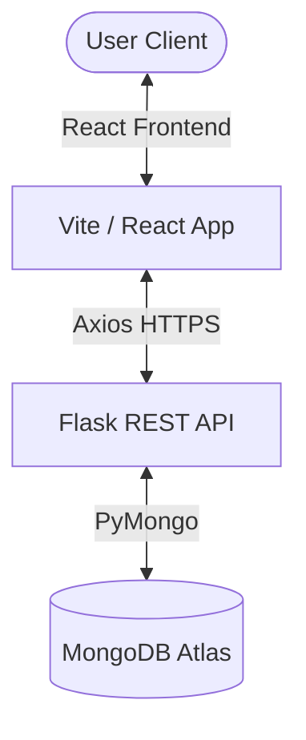
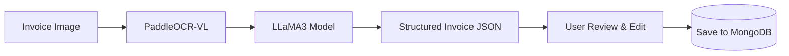
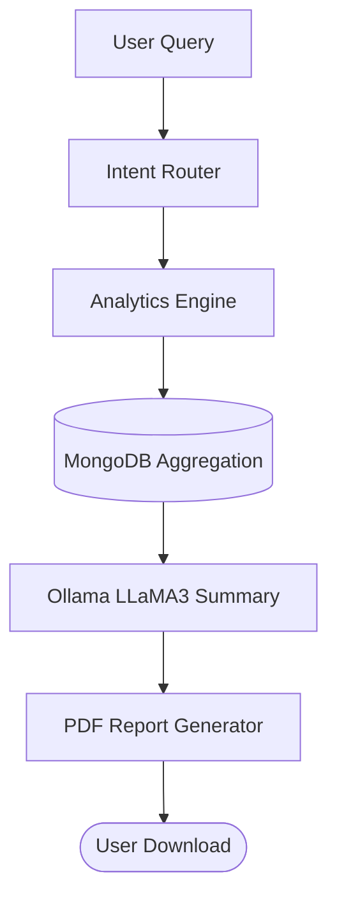

# InvoiceAI

### AI-Powered Invoice Processing, OCR Automation, Business Intelligence & Reporting Platform

InvoiceAI is an enterprise-grade AI-powered invoice processing platform that automates invoice extraction, validation, analytics, reporting, and business intelligence using OCR, LLMs, and secure role-based access controls.

---

## 1. Key Features

| Domain | Implemented Features |
| :--- | :--- |
| **Authentication & Security** | <ul><li>Google OAuth 2.0 Sign-In Integration</li><li>Secure JWT Token-based Sessions</li><li>Role-Based Access Control (Admin vs. Standard User)</li><li>Strict User Data Isolation & Protected APIs</li><li>Comprehensive System Activity & Audit Logging</li></ul> |
| **OCR & Invoice Processing** | <ul><li>PaddleOCR-VL Visual & Text Extraction Pipeline</li><li>Local LLM (LLaMA3) Post-Processing for High Accuracy</li><li>Interactive Form Interface with Editable Invoice Fields</li><li>Structured Invoice Review Workflow (Pending, Reviewed, Corrected)</li><li>Automatic Tax calculations (CGST, SGST, IGST)</li><li>Traceable Invoice Modification History</li><li>Secure Invoice Image Upload and Storage</li></ul> |
| **Analytics & BI Dashboard** | <ul><li>Monthly Invoice Volume Charts</li><li>Monthly Billing Revenue Trend Lines</li><li>OCR Extraction Error & Correction Analysis</li><li>GST Distribution Breakdown (CGST vs. SGST vs. IGST Pie Chart)</li><li>Top Buyers by Billing Metrics</li><li>Revenue Contribution by Buyer (Horizontal 100% Stacked Bar Chart)</li></ul> |
| **AI Assistant (NiBo)** | <ul><li>Natural Language Querying for Invoices & Billings</li><li>Automated Revenue Trend Summarization</li><li>GST and Tax collection analysis</li><li>System & OCR Accuracy Quality Insights</li><li>On-the-fly Business Reporting</li><li>Exportable PDF Report Generation with ReportLab</li></ul> |
| **Administration** | <ul><li>User Account Management (Status Activation/Deactivation)</li><li>Real-time User Activity Monitoring Logs</li><li>System-wide Volume & Revenue Analytics</li><li>Global Visibility over all Invoices</li></ul> |

---

## 2. Architecture Overview

### System Data Flow


### OCR Processing Flow


### AI Assistant & Reporting Flow


---

## 3. Technology Stack

### Frontend
* **Core:** React 19, Vite, Tailwind CSS
* **Routing & State:** React Router, React Hook Form
* **Charts:** Chart.js, React-Chartjs-2
* **Networking & Utilities:** Axios, Lucide React, React Toastify, PapaParse

### Backend
* **Server:** Flask, Flask-CORS, Werkzeug
* **Database Driver:** PyMongo
* **Authentication:** Google Auth, PyJWT, Python-Dotenv

### AI / ML Core
* **OCR engine:** PaddleOCR-VL
* **Local Inference:** Ollama, LLaMA3 Model
* **Model Pipeline:** Transformers, PyTorch

### Database
* **Database:** MongoDB Atlas (NoSQL)

### PDF Reporting
* **Engine:** ReportLab

---

## 4. Folder Structure

```text
paddleocrVL-1.6/
│
├── backend_app.py          # Main Flask REST API & Routes
├── ocr_engine.py           # PaddleOCR-VL & LLM Extraction pipeline
├── chatbot_service.py      # NiBo AI Assistant orchestrator & cache
├── intent_router.py        # Chatbot Query Intent Classifier
├── analytics_queries.py    # MongoDB aggregation pipeline builders
├── report_generator.py     # AI text summary generation
├── pdf_generator.py        # ReportLab PDF compilation service
├── promote_admin.py        # Script to elevate user role to Admin
├── requirements.txt        # Python backend package requirements
│
├── uploads/                # Directory storing uploaded invoice images
├── reports/                # Directory storing generated PDF reports
│
└── frontend/               # React Vite Frontend Application
    ├── package.json        # Frontend dependencies & npm scripts
    ├── vite.config.js      # Vite configuration file
    ├── tailwind.config.js  # Tailwind CSS custom themes & layout
    ├── index.html          # Main HTML5 entrypoint
    └── src/
        ├── main.jsx        # App entry point
        ├── App.jsx         # App router & layouts
        ├── index.css       # Global styles & design system
        ├── components/     # Reusable widgets (Layout, ChatAssistant, ProtectedRoute)
        ├── pages/          # Full page views (Dashboard, Analytics, AdminDashboard, etc.)
        ├── services/       # Frontend api service module (api.js)
        └── utils/          # Utility scripts (csvExport.js)
```

---

## 5. Database Collections

### 1. `users`
Tracks registered users, permissions, and session timestamps.
* `_id`: ObjectId (Primary Key)
* `email`: String (Unique)
* `name`: String
* `role`: String ("user" | "admin")
* `is_active`: Boolean
* `created_at`: Date
* `last_login`: Date

### 2. `invoices`
Stores metadata, OCR parsed values, human-edited entries, and correction logs.
* `_id`: ObjectId (Primary Key)
* `user_id`: ObjectId (Uploader identity)
* `file_path`: String
* `extracted_data`: Object (Raw OCR output)
* `invoice_data`: Object (Active/edited structure)
  * `invoice_number`: String
  * `invoice_date`: Date
  * `vendor_name`: String
  * `buyer_name`: String
  * `items`: Array of Objects (description, quantity, rate, cgst_amount, sgst_amount, igst_amount, amount)
  * `total_tax`: Double
  * `total_revenue`: Double
* `review_status`: String ("Pending Review" | "Reviewed" | "Corrected")
* `change_history`: Array of Objects (timestamp, edited_by, diff)
* `created_at`: Date

### 3. `activity_logs`
An immutable log auditing user actions and security events.
* `_id`: ObjectId (Primary Key)
* `user_id`: ObjectId
* `user_email`: String
* `action`: String (e.g., "ocr_upload", "invoice_edit", "login", "chatbot_query")
* `metadata`: Object (Specific contextual variables)
* `timestamp`: Date

### 4. `reports`
Metadata catalog for exported PDF reporting operations.
* `_id`: ObjectId (Primary Key)
* `user_id`: ObjectId
* `report_type`: String (e.g., "monthly_report", "quarterly_report", "yearly_report")
* `generated_at`: Date
* `pdf_filename`: String
* `summary`: String (LLM generated report overview)

---

## 6. Installation Guide

### Prerequisites
* Python 3.8+ (with pip)
* Node.js 18+ (with npm)
* MongoDB database instance
* Ollama local LLM runner (with `llama3` model pulled)

### 1. Backend Setup
Clone the repository, initialize the virtual environment, and install package dependencies:
```bash
# Clone the repository
git clone <repo-url>
cd paddleocrVL-1.6

# Create and activate virtual environment
python -m venv .venv
source .venv/bin/activate  # On Windows: .venv\Scripts\activate

# Install requirements
pip install -r requirements.txt
```

### 2. Environment Setup
Create a `.env` file in the root directory:
```env
MONGODB_URI=mongodb+srv://<username>:<password>@cluster0.mongodb.net/
DB_NAME=invoice_db
COLLECTION_NAME=invoices
GOOGLE_CLIENT_ID=your-google-oauth-client-id
JWT_SECRET_KEY=your-secure-jwt-secret-key

# Chatbot & Report Settings
CHAT_CACHE_TTL_MINUTES=5
CHAT_MAX_HISTORY=50
REPORTS_DIRECTORY=reports
MAX_REPORT_RECORDS=100
OLLAMA_MODEL=llama3
REPORT_RETENTION_DAYS=30
```
Create a `.env` file in the frontend directory:
```env
VITE_API_URL=http://localhost:5000
VITE_GOOGLE_CLIENT_ID=your-google-client-id.apps.googleusercontent.com

```

### 3. Frontend Setup
Navigate into the `frontend` folder, install package dependencies, and start the development server:
```bash
cd frontend
npm install
npm run dev
```

### 4. Running Backend REST API
Ensure your virtual environment is active, then run:
```bash
python backend_app.py
```

### 5. Running Ollama Local LLM
Ensure Ollama is running and has the `llama3` model loaded:
```bash
# Start Ollama service
ollama serve

# Confirm LLaMA3 model is pulled
ollama pull llama3
ollama list
```

---

## 7. User Roles & Permissions

| Action / Permission | Standard User (`role = "user"`) | Administrator (`role = "admin"`) |
| :--- | :---: | :---: |
| **Upload Invoice Image** | ✓ | ✓ |
| **Edit / Review Extracted Invoice** | ✓ (Own only) | ✓ (All) |
| **View Analytics Dashboard** | ✓ (Own calculations) | ✓ (All) |
| **Ask NiBo Chatbot Queries** | ✓ (Own data context) | ✓ (All systems) |
| **Generate & Export PDF Reports** | ✓ | ✓ |
| **Access Admin Dashboard & Logs** | ✗ | ✓ |
| **Manage Users (Block / Activate)** | ✗ | ✓ |
| **Global System-Wide Visibility** | ✗ | ✓ |

---

## 8. API Endpoints

### Authentication
* `POST /api/auth/google` - Exchanges Google OAuth credential token for JWT.

### Invoices
* `GET /api/invoices` - Retrieve invoice history (scoped or global depending on user role).
* `POST /api/invoices` - Upload a new invoice image and run the PaddleOCR extraction pipeline.
* `GET /api/invoices/<id>` - Fetch details of a single invoice.
* `PUT /api/invoices/<id>` - Submit updates / correction inputs for an invoice.
* `DELETE /api/invoices/<id>` - Delete an invoice.

### Analytics
* `GET /api/analytics` - Retrieve user-scoped business analytics metrics.
* `GET /api/admin/analytics` - Retrieve global, system-wide KPIs.

### Reports
* `POST /api/chat/report` - Trigger on-the-fly PDF generation based on chatbot analytics context.
* `GET /api/reports` - Fetch list of previously generated reports.
* `GET /api/reports/download/<filename>` - Download a generated PDF report file.
* `DELETE /api/reports/<id>` - Permanently delete a report record.

### NiBo AI Chat
* `POST /api/chat/query` - Send query strings to NiBo chatbot for analysis, NLP summaries, and prompt execution.

### Admin Tools
* `GET /api/admin/users` - Fetch all system user accounts.
* `PUT /api/admin/users/<id>/status` - Activate or block a user account.
* `GET /api/admin/activity` - Fetch system audit activity logs.

---

## 9. Interface Placeholders

### Login Page
`[Screenshot Placeholder: Secure Google OAuth and email-based login screen with high-contrast emerald colors]`

### Dashboard
`[Screenshot Placeholder: User dashboard highlighting statistics widgets, recent uploads list, and quick navigation headers]`

### Invoice Extraction
`[Screenshot Placeholder: Image-to-text extraction screen showing the original image alongside an editable, side-by-side data review panel]`

### Analytics
`[Screenshot Placeholder: Interactive chart views showcasing Monthly volume, Billing revenue, Pie Chart GST spreads, and the Buyer Revenue Contribution Stacked Bar]`

### Admin Dashboard
`[Screenshot Placeholder: Admin dashboard providing access to user management list, active session metrics, and live audit logging feeds]`

### NiBo AI Assistant
`[Screenshot Placeholder: Floating chatbot assistant window with quick query buttons, chat bubbles, and formatted business reports]`

### Reports
`[Screenshot Placeholder: Historical view of generated reports ready for local PDF download or server deletion]`

---

## 10. Security Features

* **JWT Verification:** All protected API routes require a valid Bearer JWT. Session expiry is strictly enforced.
* **Role-Based Access Control (RBAC):** Admin routes are blocked from standard users at the backend level.
* **Ownership Validation:** Standard users cannot access, edit, or query invoices belonging to other accounts.
* **Report Access Security:** Prevent Path Traversal attacks by sanitizing inputs on directory requests.
* **Immutable Logs:** System events, login details, edits, and administrative overrides are saved permanently in `activity_logs`.
* **Google Token Integrity:** Google OAuth credentials are authenticated via Google's `id_token` verification endpoint.

---

## 11. Future Enhancements

* **Automated Scheduler:** Run weekly or monthly automated reports and deliver them straight to user emails.
* **Email Delivery:** Send invoice copies and payment reminders to clients directly from the application.
* **Multi-Language OCR support:** Add multi-language character matching models to PaddleOCR.
* **Business Forecasting:** Implement historical models to project future billing, tax cycles, and seasonal revenue.
* **Vendor Risk Analysis:** Audit supplier invoice patterns to flag potential price variations or duplication errors.

---

## 12. Authors & License

### Authors
* **Boomika S** - [GitHub](https://github.com/boomiikas) | [LinkedIn](https://www.linkedin.com/in/boomika-s-981b55311/)
* **Nithya Shri S K** - [GitHub](https://github.com/NithyaShriSK) | [LinkedIn](https://www.linkedin.com/in/nithya-shri-s-k-670531353/)

---

## 13. License

Distributed under the MIT License. See `LICENSE` for details.
