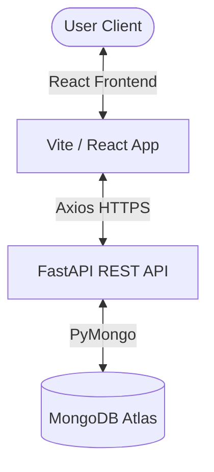
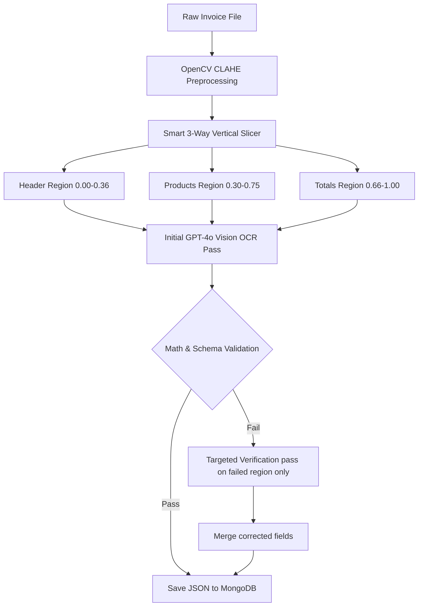

# InvoiceAI 2.0

### AI-Powered Invoice Processing, OCR Automation, Business Intelligence & Reporting Platform

InvoiceAI is an enterprise-grade AI-powered invoice processing platform that automates invoice extraction, validation, analytics, reporting, and business intelligence using hybrid OCR pipelines, OpenAI GPT-4o Vision, and role-based access control.

---

## 1. Key Features

| Domain | Implemented Features |
| :--- | :--- |
| **Authentication & Security** | <ul><li>Google OAuth 2.0 Sign-In Integration</li><li>Secure JWT Token-based Sessions</li><li>Role-Based Access Control (Admin vs. Standard User)</li><li>Strict User Data Isolation & Protected APIs</li><li>Comprehensive System Activity & Audit Logging</li></ul> |
| **OCR & Processing** | <ul><li>CLAHE Preprocessing and Smart 3-Way Slicing Pipeline</li><li>OpenAI GPT-4o Vision OCR Extraction</li><li>Interactive Form Interface with Editable Invoice Fields</li><li>Automatic Tax calculations (CGST, SGST, IGST)</li><li>Indian Rupee Number-to-Words auto conversion</li><li>Traceable Invoice Modification History</li><li>Secure Image/PDF upload handling</li></ul> |
| **Analytics & BI Dashboard** | <ul><li>Unified Dashboard containing summary KPIs and aggregations</li><li>Monthly Invoice Volume Bar Charts</li><li>Monthly Billing Revenue Trend Lines</li><li>GST Distribution Breakdown (CGST vs. SGST vs. IGST Pie Chart)</li><li>Top Vendors and Buyers breakdown</li><li>Date Range filter to dynamically slice ledger stats</li></ul> |
| **AI Assistant & Reporting** | <ul><li>Natural Language Querying for Invoices & Billings</li><li>Automated Revenue Trend Summarization</li><li>On-the-fly Business Reporting</li><li>Exportable PDF Report Generation with ReportLab</li></ul> |
| **Administration** | <ul><li>User Account Management (Status Activation/Deactivation)</li><li>Real-time User Activity Monitoring Logs</li><li>Global Visibility over all Invoices</li></ul> |

---

## 2. System Architecture



---

## 3. Invoice OCR Architecture

The platform uses an optimized visual OCR pipeline designed to maximize data extraction accuracy while minimizing API token usage:



1. **CLAHE Image Preprocessing**: Restores contrast and text definition using OpenCV Contrast Limited Adaptive Histogram Equalization.
2. **Smart 3-Way Vertical Slicer**: Crops the invoice page into three overlapping visual components (Header, Products, and Totals) based on verified geometric ratios.
3. **Initial Vision Pass**: Consolidates the three slices into a single vision completion call.
4. **Validation Check**: Python-side math validators audit `Rate * Quantity = Amount` formulas.
5. **Targeted Verification**: If discrepancies are found, a second pass is executed **only on the specific failed region slice**, merging corrections back and keeping token consumption minimal.

---

## 4. Technology Stack

### Frontend
* **Core:** React 19, Vite 8, Tailwind CSS 3
* **Routing & State:** React Router, React Hook Form
* **Charts:** Chart.js, React-Chartjs-2
* **Networking & Utilities:** Axios, Lucide React, React Toastify, PapaParse
* **Fonts & Styling:** Outfit (Sans-Serif) & Playfair Display (Serif)

### Backend
* **Server:** FastAPI, Uvicorn, ASGI
* **Database Driver:** PyMongo, Dnspython
* **Authentication:** Google Auth, PyJWT, Cryptography, Python-Dotenv
* **OCR & Image Processing:** OpenCV-Python-Headless, PyMuPDF (Fitz), Pillow, NumPy
* **PDF Compilation:** ReportLab

### Database
* **Database:** MongoDB Atlas (NoSQL)

---

## 5. Local Setup & Configuration

### Prerequisites
* Python 3.10+
* Node.js 18+
* MongoDB Atlas Cluster or local MongoDB instance

### Environment Variables
Configure the environment variables in a `.env` file at the project root (reference [`.env.example`](.env.example)):

```ini
# MongoDB Configuration
MONGODB_URI=mongodb+srv://<username>:<password>@<cluster>.mongodb.net/?appName=Cluster0
DB_NAME=invoice_ocr
COLLECTION_NAME=invoices

# Authentication Keys
GOOGLE_CLIENT_ID=<your-google-oauth-client-id>.apps.googleusercontent.com
JWT_SECRET_KEY=<your-jwt-secret-signing-key>

# OpenAI API Config
OPENAI_API_KEY=sk-proj-<your-openai-api-key>
OPENAI_MODEL=gpt-4o
OPENAI_BASE_URL=https://api.openai.com/v1

# Cache Settings
CHAT_CACHE_TTL_MINUTES=5
CHAT_MAX_HISTORY=50
REPORTS_DIRECTORY=reports
MAX_REPORT_RECORDS=5000
REPORT_RETENTION_DAYS=180
```

For the React frontend, configure `frontend/.env` (reference [`frontend/.env.example`](frontend/.env.example)):
```ini
VITE_API_URL=http://localhost:5000
VITE_GOOGLE_CLIENT_ID=<your-google-oauth-client-id>.apps.googleusercontent.com
```

---

## 6. How to Run Locally

### Running the Backend (FastAPI)
1. Navigate to the root directory.
2. Create and activate a virtual environment.
3. Install dependencies:
   ```bash
   pip install -r requirements.txt
   ```
4. Start the Uvicorn application server:
   ```bash
   python backend_app.py
   ```
5. The API will start on `http://localhost:5000`.

### Running the Frontend (React + Vite)
1. Navigate to the `/frontend` directory:
   ```bash
   cd frontend
   ```
2. Install node dependencies:
   ```bash
   npm install
   ```
3. Run the development build:
   ```bash
   npm run dev
   ```
4. Access the web interface in your browser at `http://localhost:5173`.

---

## 7. API Health Check Endpoint

Use the following simplified health-check route to verify backend deployment readiness:

* **Endpoint**: `GET /api/health`
* **Response Payload**:
  ```json
  {
    "status": "ok"
  }
  ```

---

## 8. Vercel Deployment Instructions

The repository has been structured for Vercel deployment under a unified serverless environment.

### Deployment Steps
1. Push your code to your GitHub repository (ensure `.env` files are blocked in `.gitignore`).
2. Log in to Vercel and click **Add New Project**.
3. Select your repository.
4. Set the **Root Directory** to `/` (project root).
5. In the **Environment Variables** panel, add the keys listed in `.env.example`.
6. Click **Deploy**. Vercel will automatically build the React frontend using `@vercel/static-build` and compile the Python serverless API using `@vercel/python`.
